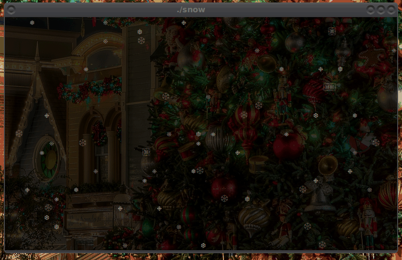

# Terminal Snow

Linux command line toy that uses the Unicode snowflake characters

## Installing

Install the build tools needed with the following command:

    $ sudo apt-get install make gcc libncursesw5-dev libtinfo5-dev libc6-dev

Clone the repo and run make to build:

    $ clone https://github.com:wporter82/snow
    $ cd snow
    $ make

